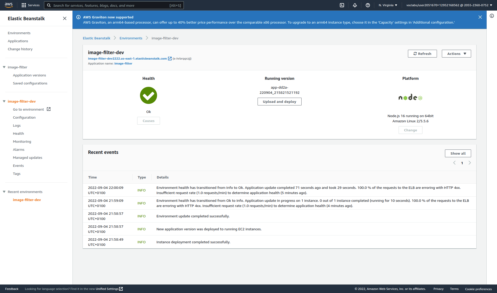

# Udagram Image Filtering Microservice

Udagram is a simple cloud application developed alongside the Udacity Cloud Engineering Nanodegree. It allows users to register and log into a web client, post photos to the feed, and process photos using an image filtering microservice.

The project is split into three parts:
1. [The Simple Frontend](https://github.com/udacity/cloud-developer/tree/master/course-02/exercises/udacity-c2-frontend)
A basic Ionic client web application which consumes the RestAPI Backend. [Covered in the course]
2. [The RestAPI Backend](https://github.com/udacity/cloud-developer/tree/master/course-02/exercises/udacity-c2-restapi), a Node-Express server which can be deployed to a cloud service. [Covered in the course]
3. [The Image Filtering Microservice](https://github.com/udacity/cloud-developer/tree/master/course-02/project/image-filter-starter-code), the final project for the course. It is a Node-Express application which runs a simple script to process images. [Your assignment]

## Github  Link 

   Github Link [https://github.com/honorezemagho/image-filter-ebs-deploy](https://github.com/honorezemagho/image-filter-ebs-deploy)

## Deployment URL
EBS deployment Url [http://image-filter-dev2222.us-east-1.elasticbeanstalk.com](http://image-filter-dev2222.us-east-1.elasticbeanstalk.com)
### Deploying your system

Follow the process described in the course to `eb init` a new application and `eb create` a new environment to deploy your image-filter service! Don't forget you can use `eb deploy` to push changes.

## Stand Out (Optional)
- sample request http://image-filter-dev2222.us-east-1.elasticbeanstalk.com/filteredimage/?image_url=https://media.wired.com/photos/621575377d11d746344b5a72/191:100/w_2287,h_1197,c_limit/Business_Person%20Working%20on%20Laptop_1302475706.jpg

### Authentication
Prevent requests without valid authentication headers.
> !!NOTE if you choose to submit this, make sure to add the token to the postman collection and export the postman collection file to your submission so we can review!

- Added token authentication for request
    - key : token , value : filter-token